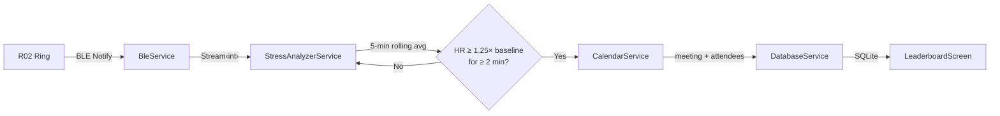

<div align="center">

# ⚡ Spike

### A premium Flutter companion app for the Colmi R02 BLE smart ring

**Real-time heart rate monitoring · Stress detection algorithm · Coworker stress leaderboard**


---

*A sleek dark-mode interface that connects to your Colmi R02 smart ring,*
*streams live biometric data, detects stress spikes during meetings, and ranks your coworkers*
*by how much they raise your heart rate.* 😅

</div>

---

## ✨ Features

### 🫀 Real-Time Heart Rate Streaming
- Connects to the Colmi R02 via **Bluetooth Low Energy** using the proprietary Colmi UART protocol
- Streams live BPM to the dashboard with a beautiful gradient area chart
- Auto-scans on launch, auto-reconnects on disconnect

### 📊 Calm Score Dashboard
- Circular calm score ring with animated progress
- Metric cards for HRV, body temperature, respiratory rate, and sleep
- Frosted-glass bottom navigation bar with smooth transitions

### 🔥 Stress Detection Algorithm
- **Rolling 5-minute baseline** calculated from a circular buffer of HR samples
- **Spike trigger**: HR ≥ baseline × 1.25 sustained for ≥ 2 consecutive minutes
- **Calendar correlation**: Automatically queries your device calendar for the active meeting
- **SQLite persistence**: Saves timestamp, peak HR, baseline, meeting title, and attendee list

### 🏆 Coworker Stress Leaderboard
- Aggregates stress events by meeting attendee
- **Podium display** for the top 3 stress-inducing coworkers (🥇🥈🥉)
- Ranked cards with initials avatars, spike counts, and average peak HR
- Auto-refreshes when new stress events are detected

---

## 🎨 Design

Spike follows a **premium dark-mode design language** with a deep palette and pastel accents:

| Role | Color | Hex |
|---|---|---|
| 🟦 Background | Deep Black | `#0A0A0F` |
| 🟩 Primary Accent | Pastel Teal | `#5ECFCA` |
| 🟥 Heart Rate | Pastel Coral | `#E8857A` |
| 🟨 Warning/Scanning | Pastel Amber | `#F0C75E` |
| 🟪 Accents | Pastel Lavender | `#B4A7D6` |
| 🌿 Connected/Success | Pastel Sage | `#8FBF9F` |

---

## 🏗️ Architecture

```
┌─────────────────────────────────────────────────────────┐
│                      Presentation                       │
│  HomeScreen · VitalsScreen · SleepScreen · Leaderboard  │
│  HeartRateCard · CalmRing · MetricCard                  │
├─────────────────────────────────────────────────────────┤
│                    State Management                     │
│         Riverpod Providers (ble · stress)               │
├─────────────────────────────────────────────────────────┤
│                      Services                           │
│  BleService · StressAnalyzerService · CalendarService   │
│  DatabaseService · ColmiProtocol                        │
├─────────────────────────────────────────────────────────┤
│                      Platform                           │
│  flutter_blue_plus · device_calendar · sqflite          │
└─────────────────────────────────────────────────────────┘
```

### Stress Detection Flow



---

## 📁 Project Structure

```
lib/
├── main.dart                          # App entry, ProviderScope, MainShell
├── models/
│   ├── stress_event.dart              # StressEvent data model + SQLite serialization
│   └── leaderboard_entry.dart         # Aggregated coworker ranking entry
├── providers/
│   ├── ble_providers.dart             # BLE connection, HR stream, auto-scan
│   └── stress_providers.dart          # Stress analyzer, DB, leaderboard providers
├── screens/
│   ├── home_screen.dart               # Calm score dashboard with ring + metrics
│   ├── vitals_screen.dart             # Heart rate & vital signs
│   ├── sleep_screen.dart              # Sleep tracking view
│   ├── activity_screen.dart           # Activity tracking view
│   └── leaderboard_screen.dart        # Coworker stress leaderboard
├── services/
│   ├── ble_service.dart               # BLE scan, connect, packet buffer, auto-reconnect
│   ├── colmi_protocol.dart            # Colmi R02 packet encoder/decoder + CRC
│   ├── calendar_service.dart          # Device calendar with overlapping event merge
│   ├── database_service.dart          # SQLite CRUD with Completer-based init
│   └── stress_analyzer_service.dart   # Rolling baseline, spike detection, reentrance guard
├── theme/
│   ├── app_colors.dart                # Spike dark palette + pastel accents
│   └── app_theme.dart                 # Material theme configuration
└── widgets/
    ├── bottom_nav_bar.dart            # Frosted-glass bottom navigation
    ├── heart_rate_card.dart           # Live HR chart with connection status dot
    ├── metric_card.dart               # Reusable metric display card
    └── readiness_ring.dart            # Custom-painted circular calm score ring
```

---

## 🔌 Colmi R02 BLE Protocol

Spike implements the **reverse-engineered Colmi UART-over-BLE protocol** (not standard Bluetooth SIG):

| Item | Value |
|---|---|
| Service UUID | `6e40fff0-b5a3-f393-e0a9-e50e24dcca9e` |
| Write Characteristic | `6e400002-b5a3-f393-e0a9-e50e24dcca9e` |
| Notify Characteristic | `6e400003-b5a3-f393-e0a9-e50e24dcca9e` |
| Packet Size | Fixed 16 bytes |
| CRC | `sum(bytes[0..14]) & 0xFF` |

### Real-Time Heart Rate

```
Send:    Cmd 105 [DataType=6 (RealtimeHR), Action=1 (Start)]
Receive: Cmd  30 [byte[1] = heart rate BPM]
```

> Protocol documentation: [colmi.puxtril.com](https://colmi.puxtril.com/commands/)

---

## 🛡️ Security & Permissions

### Android

| Permission | Purpose |
|---|---|
| `BLUETOOTH_SCAN` | Discover nearby R02 ring |
| `BLUETOOTH_CONNECT` | Establish BLE connection |
| `ACCESS_FINE_LOCATION` | Required for BLE scanning (Android 6-11) |
| `FOREGROUND_SERVICE` | Keep BLE alive in background (API 34+) |
| `FOREGROUND_SERVICE_CONNECTED_DEVICE` | Android 15 BLE background restriction |
| `READ_CALENDAR` | Read meeting attendees for stress correlation |

### iOS

| Key | Purpose |
|---|---|
| `NSBluetoothAlwaysUsageDescription` | BLE access |
| `NSLocationWhenInUseUsageDescription` | BLE scanning requires location |
| `NSCalendarsUsageDescription` | Calendar access (legacy) |
| `NSCalendarsFullAccessUsageDescription` | Calendar + attendee access (iOS 17+) |

---

## 🚀 Getting Started

### Prerequisites

- Flutter SDK ≥ 3.7.0
- Xcode 15+ (for iOS)
- Android Studio / SDK (minSdk 21)
- A **Colmi R02** smart ring (for BLE features)

### Installation

```bash
# Clone the repository
git clone https://github.com/yourusername/spike.git
cd spike

# Install dependencies
flutter pub get

# Run on a connected device (BLE requires a physical device)
flutter run
```

> **Note**: BLE scanning does not work on emulators/simulators. You need a physical device with Bluetooth LE support.

### Verify

```bash
# Static analysis
flutter analyze

# Run tests
flutter test
```

---

## 📦 Dependencies

| Package | Version | Purpose |
|---|---|---|
| [`flutter_blue_plus`](https://pub.dev/packages/flutter_blue_plus) | ^1.35.2 | Bluetooth Low Energy communication |
| [`flutter_riverpod`](https://pub.dev/packages/flutter_riverpod) | ^2.6.1 | Reactive state management |
| [`fl_chart`](https://pub.dev/packages/fl_chart) | ^0.70.2 | Heart rate area chart visualization |
| [`device_calendar`](https://pub.dev/packages/device_calendar) | ^4.3.3 | Local calendar event + attendee reading |
| [`sqflite`](https://pub.dev/packages/sqflite) | ^2.4.2 | Local SQLite database for stress events |
| [`google_fonts`](https://pub.dev/packages/google_fonts) | ^6.2.1 | Inter font family for typography |

---

## 🧠 How the Stress Algorithm Works

```
1. Collect HR samples into a 5-minute circular buffer
2. Calculate rolling mean → this is the "baseline"
3. If current HR ≥ baseline × 1.25 → start spike timer
4. If spike persists ≥ 2 minutes continuously → STRESS EVENT
5. Query device calendar for active meeting(s)
6. Merge attendees from ALL overlapping events
7. Save { timestamp, peakHR, baseline, meeting, attendees } → SQLite
8. 5-minute cooldown before next event can fire
```

### Safeguards

- **Connection gap detection**: If no HR sample for >10s, baseline buffer is flushed
- **Reentrance guard**: Prevents duplicate events during async calendar/DB operations
- **MTU packet buffering**: Handles fragmented BLE payloads across notifications
- **CRC validation**: Rejects corrupted packets before parsing
- **Auto-reconnect**: 3-second delay then re-scans after unexpected disconnect

---

## 🗄️ Database Schema

```sql
CREATE TABLE stress_events (
    id               INTEGER PRIMARY KEY AUTOINCREMENT,
    timestamp        TEXT NOT NULL,       -- ISO 8601
    peak_hr          INTEGER NOT NULL,    -- Maximum HR during spike
    baseline_hr      INTEGER NOT NULL,    -- Rolling average at trigger
    meeting_title    TEXT,                -- From calendar (nullable)
    attendees        TEXT,                -- JSON array: ["Alice", "Bob"]
    duration_seconds INTEGER NOT NULL     -- Spike duration in seconds
);
```

---

## 📄 License

This project is licensed under the MIT License — see the [LICENSE](LICENSE) file for details.

---

<div align="center">

**Built with ⚡ by Spike**

*Because the real heart rate monitor is the meetings we survived along the way.*

</div>
